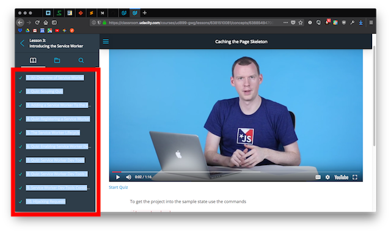

# Markdown resources

<!-- START doctoc generated TOC please keep comment here to allow auto update -->
<!-- DON'T EDIT THIS SECTION, INSTEAD RE-RUN doctoc TO UPDATE -->
**Table of Contents**  *generated with [DocToc](https://github.com/thlorenz/doctoc)*

- [Intro](#intro)
- [Markdown syntax](#markdown-syntax)
- [Markdown methods](#markdown-methods)
- [Apps that use Markdown](#apps-that-use-markdown)

<!-- END doctoc generated TOC please keep comment here to allow auto update -->


## Intro

*Saturday, February 24, 2018*

Hi Everyone! The `#massachusetts` Slack group had a great meeting today. One of the helpful things we discussed was using **Markdown** to keep documentation. **Markdown is a syntax for easy generation of HTML pages from plain text files.** It has most of the functionality of HTML while being much easier to read, and is very widely used (for example, READMEs on GitHub).

I've gotten really into Markdown, and it's helped me keep track of my Udacity work. It's really good to **capture the train of thought,** so you can retrace your steps and **retain what you have learned.**

I will be posting my course notes on GitHub, so you can see how I use Markdown for the course. Our fellow Google Udacian @tophergates shared his notes as well (see [forum post](https://discussions.udacity.com/t/learning-resources-mobile-web-category/522382/18) and [GitHub](https://github.com/tophergates/mobile-web-specialist))

I will share my methods here, and will post this file (*md.md*) on GitHub. I hope this is helpful!


## Markdown syntax

### Resources

* [MarkdownGuide](https://www.markdownguide.org/)
* [GitHub-Flavored Markdown](https://guides.github.com/features/mastering-markdown/)
* [Dillinger](https://dillinger.io/) is a helpful online Markdown editor with live preview.
* [Udacity README course](https://www.udacity.com/course/writing-readmes--ud777)


### Suggestions

Here are a few pointers:


#### Headers

* Create headers with `#`. Each `#` increases header level (`##` is outline level two), up to six levels.
* **For organization, I reserve H1 (`#`) for the title of the file at the top. Major headers begin with H2 (`##`).**
* **For clarity, I leave one blank line after each header, and two blank lines before the next header.**
* **For navigation in Markdown files, it is also helpful to include [(back to top)](#top) links under the major headers for easy navigation back to the top of the document.** Simply write `[(back to top)](#top)`.
* I use the headers to create a **Table of Contents (TOC)** at the beginning of the files with [DocToc](https://github.com/thlorenz/doctoc). JupyterLab and RStudio have inline TOC displays that are really nice. See [below](#jupyterlab).


#### Text

* **Bold text:** use **double star at beginning and end of text to bold**
* **Italics:** *Single star with no space before and after.* _Underscores also work._


#### Lists

* **Lists should be preceded by a blank line.**
* Single `*`, `-`, or `+` at beginning of line, followed by tab or space.
	- Indent with tab for next outline level
		+ Like this

1. Ordered lists
2. Like this
	- And you can add in unordered lists.
	- Like this
3. Inside of ordered lists.


#### Code

You can include `inline code inside single backticks`

```
Fenced code blocks inside triple backticks
```

* Code blocks can be indented to match your lists
	```
	like this
	```
* In GitHub-Flavored Markdown, you can specify the language next to the first set of triple backticks for syntax highlighting:
	- Bash
		```bash
		$ git reset --hard
		$ git checkout origin/task-page-skeleton
		```
	- JavaScript
		```javascript
		// have new service worker take over right when refresh is pressed
		self.skipWaiting()
		
		// from a page
		reg.installing.postMessage({foo: 'bar'});
		
		// in the service worker
		self.addEventListener('message', function(event) {
			event.data; // {foo: 'bar'}
		});
		
		// when the new service worker has taken over, signal page reload
		navigator.serviceWorker.addEventListener('controllerchange', function() {
			// navigator.serviceWorker.controller has changed
			});
		```
	- Python
		```python
		name = input("Please type your name: ")
		print('Great job', name + '!', 'Keep practicing your Python!')
		```


### File paths

* Local disk: use UNIX format file paths
* Dropbox URLs: **To use Dropbox links in Markdown, change the end of the link from dl=0 to dl=1.** In this way, images can be embedded and datasets can be referenced by URL without having to download a local copy.


### Images

```
`
```

I still prefer to use HTML image tags, because they allow for more customization:

```

```


## Markdown methods

* When I begin a lesson, I create a new file in my text editor.
* I use `H1` for the title at the top, like `# Lesson 3. An Overview of Service Worker`.
* I paste in the sections of the lesson from the Udacity interface, and set each one to `H3`.
	
	

* As I go through the lesson, I take notes on what I do in each step. My notes from Lesson 3 are a helpful example.
	- If I write code, I include it with code blocks.
	- If I get stuck, I explain the steps I take to solve the problem.
* At the end of the lesson, I use [DocToc](https://github.com/thlorenz/doctoc) to generate a Table of Contents from the headers.
* I write feedback, and paste it into the feedback popup box in the Udacity lesson.


## Apps that use Markdown

### Social

#### This forum!

You can use Markdown formatting in your forum posts like I am here! See GitHub for the source code.


#### ~~Slack~~

Slack uses a simplified pseudo-Markdown and has [stated](https://get.slack.help/hc/en-us/articles/202288908#a-note-about-markdown) that it will not be building in full Markdown capabilities.


### Text editors

Most code editors have extensions for Markdown.

#### Sublime Text

I currently use [Sublime Text](http://www.sublimetext.com/) for most of my coding. It's fast, responsive, and packages give it powerful features.

Here's how to set up Sublime Text for Markdown:

* Install [Sublime Text](http://www.sublimetext.com/)
	- I like the Mariana color scheme and the Adaptive theme.
* Install [Package Control](https://packagecontrol.io/)
* Use Package Control from within Sublime Text to install:
	- MarkdownEditing
	- Markdown Preview
* Type sublimely in autocomplete bliss!

You can see my full setup, including keybindings, on [GitHub](https://github.com/br3ndonland/general/blob/master/br3ndonland_terminal.md).


#### Atom

[Atom](https://atom.io/) has good Markdown support. See the [Flight Manual](https://flight-manual.atom.io/using-atom/sections/writing-in-atom/) for instructions.


#### Visual Studio Code (vscode)

I haven't used vscode, but they provide helpful [instructions](https://code.visualstudio.com/Docs/languages/markdown) on how to configure it for Markdown.


#### JupyterLab

[JupyterLab](http://jupyterlab.readthedocs.io/en/latest/) is produced by [Project Jupyter](http://jupyter.org/). It is most widely used for scientific computing with Python, but supports many programming languages. It allows you to create "reproducible computational narratives," containing Markdown text interspersed with code chunks that you can run.

They just released [some awesome updates](https://blog.jupyter.org/jupyterlab-is-ready-for-users-5a6f039b8906) that I'm really excited about!

It is easiest to install JupyterLab through [Anaconda](http://jupyter.org/install).


#### RStudio

* [RStudio](https://www.rstudio.com/) is an IDE for the R programming language, used mostly for statistics and data science.
* Like JupyterLab, RMarkdown documents contain Markdown text with functional R code chunks.
* I have written up a [guide to R](https://rpubs.com/br3ndonland/Rguide), and an [example of scientific data analysis](https://rpubs.com/br3ndonland/Rproteomics-2016-Nrf1), using RMarkdown. They're currently hosted on the free [RPubs](https://rpubs.com/br3ndonland) site, but I'm working on moving them over to GitHub so you can see the source code.


### Markdown note apps

#### [Bear](http://www.bear-writer.com/)

I found Bear via [M.G. Siegler in 500 words on Medium](https://500ish.com/@mgsiegler).

Pros

* Really nice Markdown editor. Uses a modified syntax called Polar Bear.
* Supports internal relative links
* Tags and subtags
* Themes
* Evernote migration and import

Cons

* Apple only
* Not encrypted
* Collaboration features could be better. No shared notebooks.


#### [Dropbox Paper](https://www.dropbox.com/paper)

Pros

* Markdown
* Collaboration
* Sync
* Embedding works well

Cons

* Paper files don't show up in your regular Dropbox file structure
* No tags
* No themes
* PDFs embedded in Dropbox Paper documents don’t lead to the actual PDF when clicked, in the mobile apps.
* PDF thumbnails are too large when inserted as single PDFs. When two or more files are inserted, the thumbnails are next to each other and the size is more reasonable. Needs a “view as attachment” option like Evernote.


#### [Laverna](https://laverna.cc/) 

Pros

* Encrypted
* Markdown
* Multimedia
* Internal linking
* Make tags with #tag
* Open source
* Built with Electron

Cons

* Evernote import?
* No Android app yet
* No dark themes yet
* No Markdown TOC


#### [Standard Notes](https://standardnotes.org/getting-started)

Pros

* Simple, dependable text note app
* Note tagging
* Themes like solarized and dark
* Extensions to add features like Markdown
* Encrypted
* Backup to Dropbox and Google Drive
* "Built to last"

Cons

* Extensions only work on desktop and web.
* Can't attach files from mobile devices.
* [Evernote import](https://standardnotes.org/evernote): formatting, images, and attachments will not be copied over. Have to break up .enex into 250 MB segments.
* Not great with multimedia. Tried to drag and drop a movie, and it just displayed the movie instead of my notes.


#### [Turtl](https://turtlapp.com/)

[Turtl blog on Tumblr](http://turtlapp.tumblr.com/)

Pros

* Promising encrypted Evernote alternative
* Markdown
* Sharing
* Some multimedia support
* Android app

Cons

* Still needs more development.
* Evernote import coming in 0.6.5
* No dark themes yet
