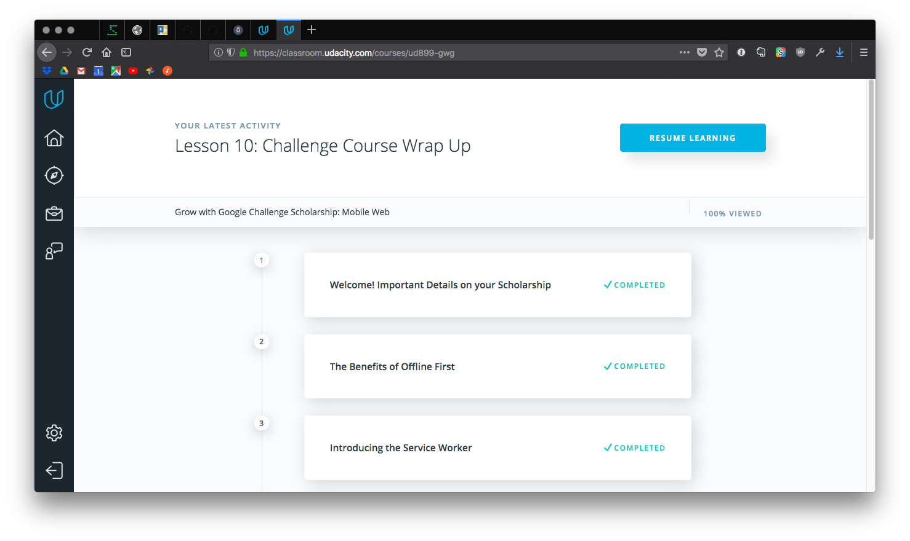

# Lesson 10. Challenge Course Wrap-Up

Udacity Grow with Google Scholarship challenge course

Intermediate Web Developer track

Brendon Smith

br3ndonland

## Table of Contents

- [Table of Contents](#table-of-contents)
- [I did it](#i-did-it)
- [Great work](#great-work)
- [Program feedback](#program-feedback)
- [Program suggestions](#program-suggestions)

## I did it

I did it! I got through all the material for the challenge course! I will find out the results mid-April.

## Great work

Message from Udacity:

> Congrats on completing the Mobile Web Specialist challenge course!
>
> It's been an awesome journey and we hope you've enjoyed the program thus far.
>
> The fun doesn't stop here. We will be evaluating your course progress and engagement in the student community to determine the recipients of Nanodegree scholarships for the second phase of this program.
>
> Stay tuned for the announcement of round two scholarship recipients on April 17!

## Program feedback

I was really pumped when I got this scholarship. And even more pumped when I started the lessons.

**I enjoyed the introduction to progressive web apps (PWAs)**. I think about PWAs every time I look at my phone. I regularly prune my app collection to remove anything I don't use, but my Google Pixel XL still currently has >150 apps. That seems like too many. I think we are over-dependent on native apps. Native apps have their place, but have reduced the openness of the web and created clutter on our mobile devices. The future seems like it's going to be in blurring the line between websites and apps. I'm excited to be surfing the next wave of PWAs!

The **timing** was challenging. When the Grow with Google challenge course began, I had been working through the Udacity Full Stack Web Developer Nanodegree program (FSND). I was a a little bit stressed about the time limit on the challenge course, and about how to budget my time between the two programs. However, with the help of my Udacity FSND mentor, I came up with an effective approach. I worked up to a good pause point in the FSND, then worked through the Grow with Google materials, finishing over a month ahead of the deadline, and then got back to the FSND.

Another challenging aspect for me was the **participation**. Social media can be distracting. It took me a little while to warm up to the forums and Slack, but I was glad I did. Two positive outcomes of the social networking were **meetups** and **pomodoros**. I got to meet up with some fellow Udacious humans in Boston. I also learned about the pomodoro technique. It's like interval training for working, and really helped me get through the course materials efficiently. My participation not only helped me, but the other students as well. I took detailed notes on the course materials and shared them on [GitHub](https://github.com/br3ndonland/udacity-google). Other students appreciated the organized, thorough notes. I also put together a [guide to writing with Markdown](markdown-guide.md) to help other students maximize their documentation.

Thanks Udacity and Google!

## Program suggestions

- **Present the ES6 lessons first.** This would especially help those of us new to JavaScript. I heard some students did the ES6 syntax lessons first and found it helpful.
- **Update the wittr code for ES6.** This would make the codebase for the course more cohesive, allowing us to apply what we learn in the ES6 syntax lessons. It is helpful to include Babel transpiling for browser compatibility, but for the students it would be more helpful to always be looking at ES6 throughout the course.
- **Explain the wittr stack more clearly.** There was a lot of code running under the hood. The instructor Jake did a good job explaining how the app connects to the internet (caching, sockets, etc), but it would have been great to have a more detailed walk-through of the code used to actually build the app.
- It would also be great to have a **project** as a more technical assessment of our performance, but I understand that it would be difficult to evaluate 10K projects.

I shared this in the Udacity discussion forum, and many people agreed.

[(Back to TOC)](#table-of-contents)